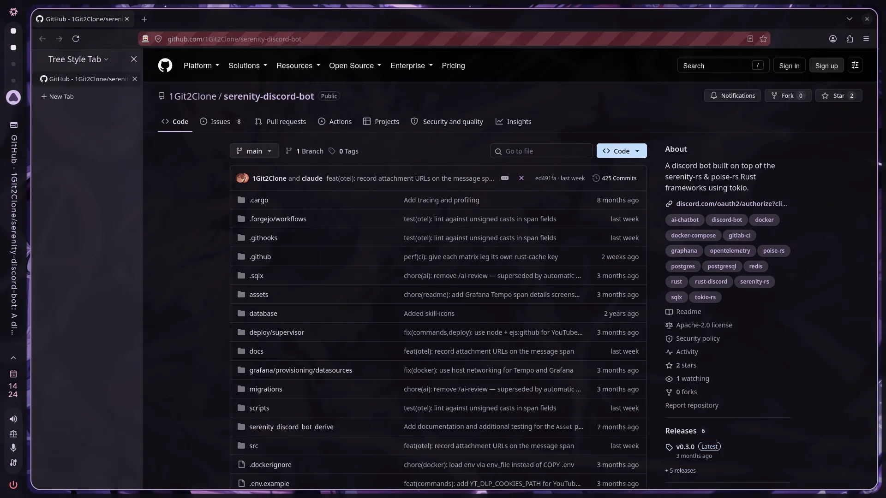
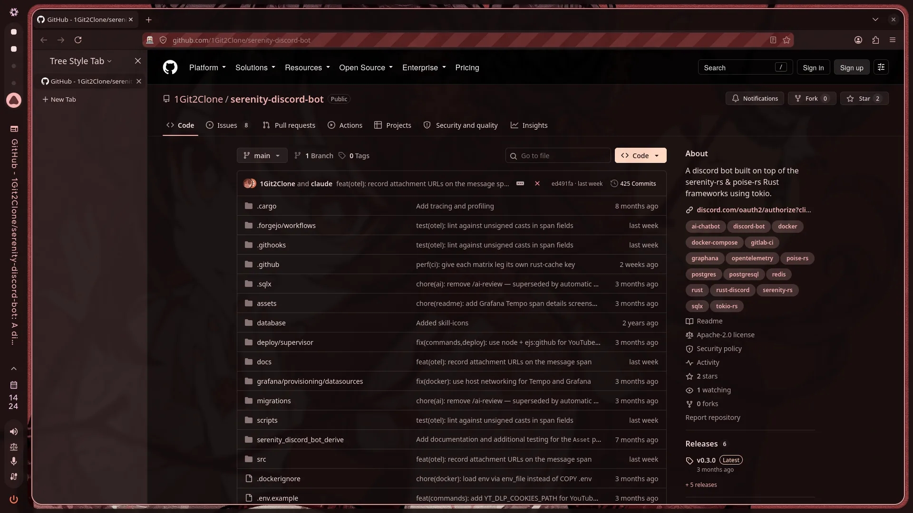
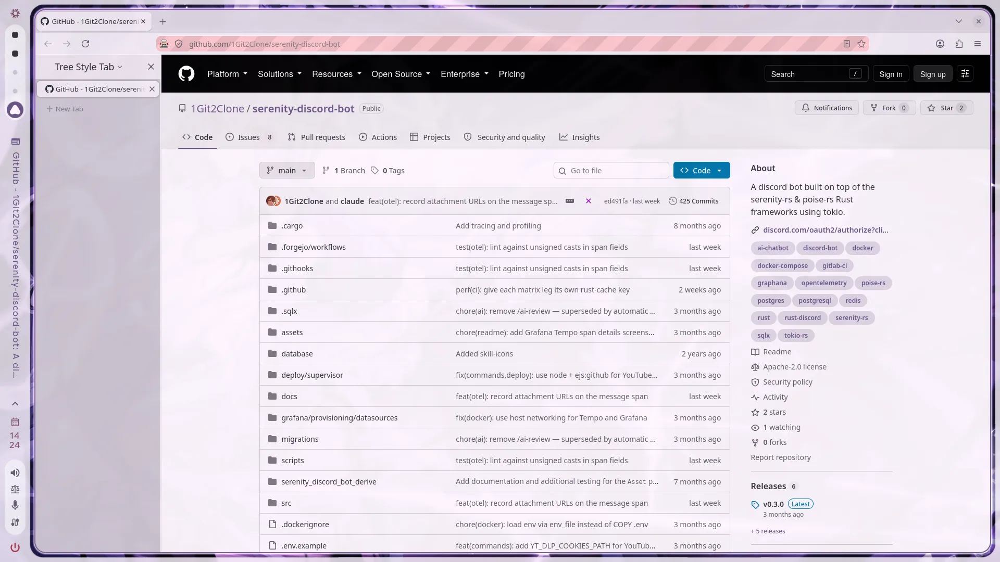
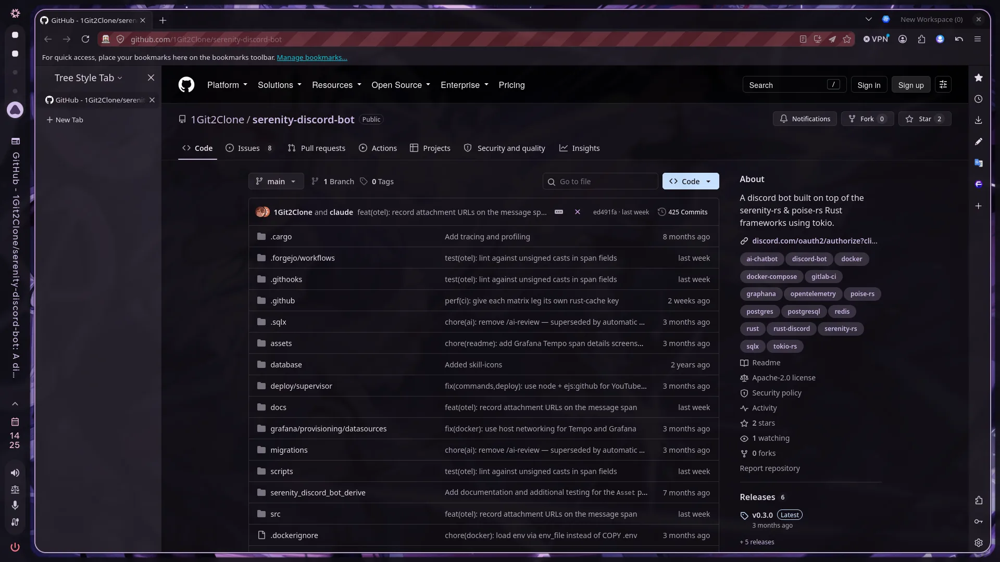
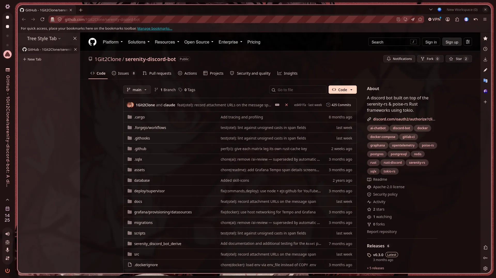
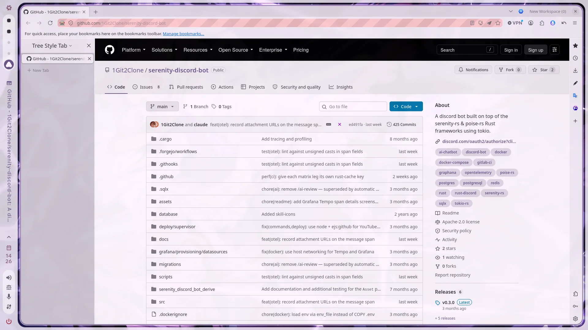
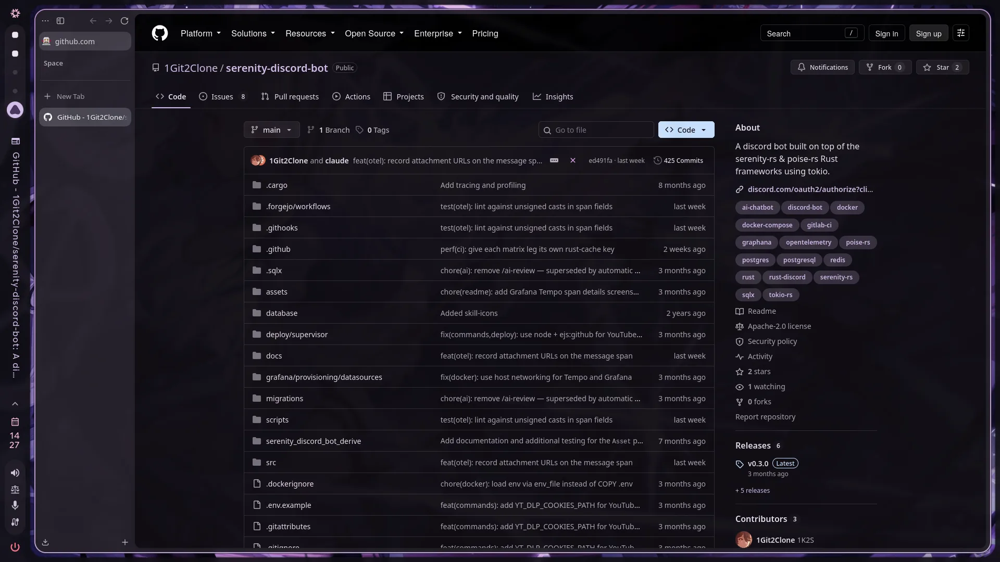
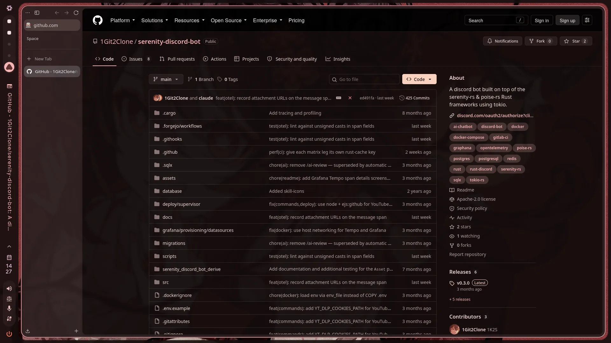
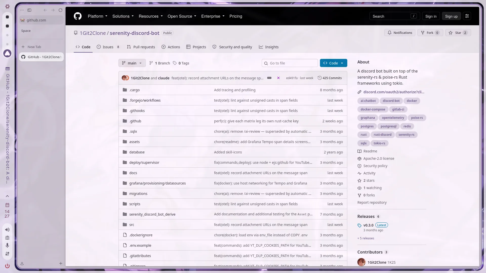

# Screenshots

Each browser in one window, switched live: the dark purple scheme, then the
dark red one from another wallpaper, then light mode. GitHub is themed by the
Catppuccin style compiled against the scheme. The sidebars are Tree Style Tab
(Firefox, Floorp) and Zen's own (Zen, through the Zen mod). Taken
2026-09-27; Firefox and Floorp with CaelestiaFox recolouring the toolbar.

| | Dark purple | Dark red | Light purple |
| --- | --- | --- | --- |
| Firefox |  |  |  |
| Floorp |  |  |  |
| Zen |  |  |  |
